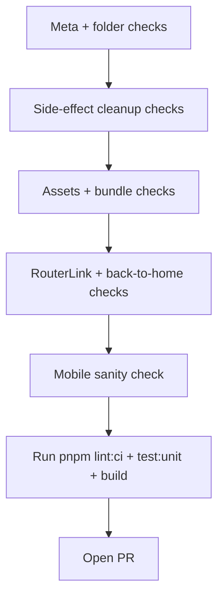

# Vibe.j2team.org sub‑app coding constitution and pre‑PR audit checklist

## Executive summary

This repository is a community “launcher + many sub‑apps” project where the maintainer, entity["organization","J2TEAM","vietnam dev community"], optimises for **safe SPA behaviour**, **fast initial load**, and **consistent UX/design** across hundreds of independently authored pages. The strongest recurring pattern in the maintainer’s own commits is “post‑merge hardening”: converting heavy assets to WebP and moving them to `public/`, removing memory leaks (timers/listeners/RAF) on route changes, enforcing stricter page metadata (especially categories and author attribution), and de‑duplicating/shared‑component refactors to keep the launcher scalable. Those patterns map cleanly into a machine‑checkable constitution for an AI coding agent and a PR audit checklist that can catch most of the things the maintainer typically edits after merge. citeturn44view0turn45view0turn64view0turn65view0turn70view0turn32view0turn72view0turn74view0

## Sources and method

### Primary sources used

Project rules and participation workflow were taken from the repository docs and metadata:

- **README**: project purpose, core rules (no DB, back link, language, no new deps, author required), and the recommended “create page” workflow. citeturn44view0  
- **AGENTS.md**: “AI‑friendly” operating manual: strict rules for sub‑apps, page structure, asset conventions, bundle size thresholds, RouterLink requirement, no secrets, and the explicit PR checklist (including the side‑effect cleanup rule and the inline `@click` multi‑statement formatting pitfall). citeturn45view0  
- **CONTRIBUTING.md**: structure recommendations, static assets guidance, EdgeToolbar behaviour and opt‑out via `showToolbar: false`. citeturn64view0  
- **Design System**: non‑negotiable visual language: colour tokens, typography, layout, “no rounded corners” principle, and page template suggestions. citeturn65view0  
- **PR template**: lightweight “run build + lint, meta.ts exists, follow Design System” checks. citeturn70view0  
- Tooling and scripts from **package.json** (linting/formatting hooks, image optimisation on staged assets, build pipeline), and deployment posture from **wrangler.json** (SPA routing). citeturn43view0turn60view0  

Maintainer behaviour was inferred from the maintainer’s visible commit history pages (filtered to commits involving/attributed to the maintainer), focusing on commit messages that indicate the kinds of fixes applied after contributions land. citeturn32view0turn33view0turn34view0turn72view0turn73view0turn74view0  

### What “systematic” means here

- I treated the **maintainer’s own commit stream** as the clearest public signal of preferences: the maintainer is the only actor consistently doing cross‑cutting refactors, perf budgets, registry/category hygiene, and SPA safety hardening. citeturn32view0turn72view0turn73view0turn74view0  
- Every constitution rule below is backed by at least one of: explicit documentation requirements (README/AGENTS/CONTRIBUTING/DESIGN_SYSTEM/PR template) or representative maintainer commits illustrating enforcement.

### Explicit assumptions and blind spots

- GitHub review comments and maintainer PR discussions that are not visible publicly are **not accessible**, so some “why” behind refactors is inferred from commit messages and repository docs rather than private discussion.  
- The commit‑history evidence is strongest for recent maintainer activity (where the tool could retrieve the relevant pages). Frequency estimates are therefore **approximate**, expressed as “how often it appears in the analysed maintainer commit sample”, not a guaranteed statistic across all time. citeturn32view0turn72view0turn74view0  
- CI/workflow specifics are inferred from the documented requirement to run `pnpm build` and `pnpm lint:ci`, and from the scripts/hooks in `package.json`; some repositories wire these via GitHub Actions, others via external deployments—this report proposes CI enhancements regardless of the current wiring. citeturn43view0turn45view0turn70view0  

## Maintainer behaviour patterns and common post‑merge edits

### What the maintainer keeps “fixing” (observable patterns)

The maintainer’s recent commit history shows five dominant themes:

- **SPA safety / side‑effects cleanup**: repeated fixes to remove timers, intervals, event listeners, and animation frames on unmount or to replace raw APIs with VueUse helpers that auto‑clean. Examples include “clean up timers and intervals on component unmount”, “add cleanup for event listeners and animation frame”, “cancel animation frame on unmount”, “replace DOMContentLoaded with Vue lifecycle hooks to prevent timer/DOM leaks”, and “extract anonymous event listeners to named functions for proper cleanup”. citeturn32view0turn33view0turn72view0turn73view0  
- **Bundle size + asset pipeline discipline**: frequent conversions to **WebP**, moving heavy assets out of JS chunks into `public/<app>/`, lazy‑loading libraries/data, and adding browser‑level perf hints (`loading="lazy"`, preloads). Examples include “convert … textures from PNG to WebP”, “convert 49 background images … to WebP”, “move large assets to public/”, “move quiz data … to lazy‑loaded JSON”, and “add loading='lazy' to off‑screen img tags”. citeturn34view0turn72view0turn73view0turn43view0turn45view0  
- **Navigation correctness and UX consistency**: enforcing `RouterLink` for internal navigation and small mobile layout correctness. Examples include “use RouterLink for homepage navigation”, “replace <a href> … with RouterLink”, and multiple mobile CTA layout fixes. citeturn34view0turn32view0turn45view0  
- **Metadata hygiene at scale**: fixes ensuring required `meta.ts` fields exist, categories are valid/updated, and category UX works with empty states. Examples include “add missing required category field to meta”, “add missing category & PageMeta type to page metas”, “correct categories for 4 apps”, “add new categories and guide empty‑category UX”, and updates to the create‑page script categories. citeturn73view0turn45view0  
- **De‑duplication and shared components**: refactors to unify repeated UI patterns (cards, filters) and centralise logic used by multiple pages. Examples include “unify duplicate page card implementations into PageCard”, “extract shared CategoryFilter component”, “deduplicate author aggregation into single module”. citeturn32view0turn73view0  

### A child‑friendly description of “what he cares about”

If the site was a big toy box:

- He wants every toy (sub‑app) to **clean up after itself** (no timers/listeners left running when you leave the page). citeturn45view0turn33view0turn72view0  
- He wants toys to be **light and fast to pick up** (don’t bundle huge images/data; put big stuff in `public/` and load it only when needed). citeturn45view0turn72view0turn73view0  
- He wants all toys to show the same “house rules” sign: **a way back home**, consistent look, and correct internal links. citeturn44view0turn45view0turn65view0turn34view0  
- He wants every toy labelled (proper `meta.ts` author + category), so the box stays organised as it grows. citeturn45view0turn73view0turn66view1  

## Coding constitution for an AI sub‑app author

### Severity scale and automation difficulty scale

- **Severity**:  
  - **Must** = violates repo rules or causes SPA/CI risk.  
  - **Favoured** = strongly aligned with maintainer patterns; likely requested in review if not followed.  
  - **Optional** = style preference / “nice to have”.

- **Automation difficulty**:  
  - **Easy** = grep/regex or file‑presence checks.  
  - **Medium** = AST parsing or build‑time inspection.  
  - **Hard** = semantic judgement/behavioural testing.

| Severity \ Automation | Easy | Medium | Hard |
|---|---:|---:|---:|
| Must | ✅ Most rules | ✅ Some rules | ⚠️ A few rules |
| Favoured | ✅ Many | ✅ Many | ⚠️ Some |
| Optional | ✅ Some | ✅ Some | ✅ Some |

### Constitution rules with evidence and checks

Each rule has: **rule text**, **why**, **evidence**, **severity**, and **automation ideas**.

#### Project boundaries and page identity

**Rule: Your code must stay inside `src/views/<app>/…` except allowed `public/<app>/…` assets.**  
Why: The project’s scalability depends on pages being self‑contained; shared files are not your sandbox. This is explicitly stated as a core rule. citeturn45view0turn44view0turn64view0  
Evidence: AGENTS rules require self‑contained pages and note the explicit exception for `public/<app>/`. citeturn45view0  
Severity: **Must**  
Automated checks:  
- CI script rejecting PRs that modify `src/views/**` plus a short allowlist (`public/<app>/`, docs if needed).  
- GitHub Action job: `git diff --name-only origin/main... | node scripts/enforce-sandbox.mjs`.

**Rule: Directory names in `src/views/` must be lowercase kebab‑case.**  
Why: Auto‑routing and consistency; it’s a declared rule. citeturn45view0turn57view0  
Evidence: AGENTS rule; maintainer refactor renaming folders to kebab‑case. citeturn45view0turn74view0  
Severity: **Must**  
Automated checks:  
- Node script: list `src/views/*` directories; validate `/^[a-z0-9]+(?:-[a-z0-9]+)*$/`.  
- Fail PR if any non‑matching directory is added/renamed.

**Rule: Every page must have `meta.ts` exporting a `PageMeta` with required fields including `author` and `category`.**  
Why: The launcher relies on metadata; maintainer frequently fixes missing category fields. citeturn45view0turn73view0turn66view1  
Evidence: PR checklist requires strict `meta.ts` shape; fixes for missing category/type. citeturn45view0turn73view0  
Severity: **Must**  
Automated checks:  
- Glob `src/views/*/meta.ts`; parse with TypeScript compiler or simple regex for `author:` and `category:`.  
- Validate `category` is in the allowed set from `create-page` script. citeturn57view0turn73view0  

**Rule: Pages must not be “landing pages”, promo pages, or mostly external redirects.**  
Why: This is explicitly prohibited to keep the project’s “sub‑app” spirit. citeturn45view0turn44view0  
Evidence: AGENTS rule disallowing landing/promotional content. citeturn45view0  
Severity: **Must**  
Automated checks: **Hard** (requires semantic judgement).  
Suggested semi‑checks: flag pages where >50% of links are external domains or where content is mostly a single CTA—manual review required.

#### Navigation and routing

**Rule: Always provide a clear navigation path back to the homepage (`/`).**  
Why: Core repo rule; also UX axiom for community launcher. citeturn44view0turn45view0turn64view0  
Evidence: README/AGENTS. citeturn44view0turn45view0  
Severity: **Must**  
Automated checks: **Medium**  
- Lint rule: ensure each page includes a `RouterLink` to `'/'` or relies on EdgeToolbar (if enabled).  
- If `showToolbar: false`, require explicit “Back to home” link in template.

**Rule: Use `<RouterLink>` for internal navigation; never raw `<a href="/…">` for app routes.**  
Why: SPA navigation correctness and consistent routing; explicitly required. Maintainer repeatedly converted pages to RouterLink. citeturn45view0turn34view0  
Evidence: PR checklist #3; maintainer fixes. citeturn45view0turn34view0  
Severity: **Must**  
Automated checks: **Easy/Medium**  
- Regex scan for `<a[^>]+href=["']\/` inside `.vue` templates; fail unless it’s truly an external link or hash link.  
- ESLint template rule if configured; otherwise custom script.

#### Side effects, lifecycle safety, and memory leaks

**Rule: Any global side effect created on mount must be cleaned up on unmount. Prefer VueUse composables that auto‑clean.**  
Why: This is the single most common “post‑merge hardening” pattern: ghost listeners/timers persist across route changes in an SPA. It is explicitly added to the PR checklist and repeatedly fixed in maintainer commits. citeturn45view0turn33view0turn72view0turn73view0  
Evidence:  
- PR checklist: clean up event listeners/timers/RAF, prefer `useEventListener`, `useIntervalFn`, `useTimeoutFn`, `useRafFn`. citeturn45view0  
- Commit examples: “clean up timers and intervals on component unmount”, “add cleanup for event listeners and animation frame”, “cancel animation frame on unmount”, “remove resize event listener on unmount”, “replace DOMContentLoaded with Vue lifecycle hooks…”. citeturn32view0turn33view0turn72view0turn73view0  
Severity: **Must**  
Automated checks: **Medium/Hard**  
- Grep for `addEventListener|setInterval|setTimeout|requestAnimationFrame` in `src/views/**`.  
  - If found, require either VueUse wrappers or matching cleanup patterns (`removeEventListener`, `clearInterval`, `clearTimeout`, `cancelAnimationFrame`) within the same component.  
- Add a small unit/integration “route churn” test harness that mounts/unmounts the route and asserts no extra global listeners remain (harder but valuable).

**Rule: Extract anonymous or multi‑statement event handlers into named functions.**  
Why: Maintainer explicitly fixed inline `@click` handlers and anonymous listener patterns; also oxfmt can break multi‑statement expressions after formatting. citeturn45view0turn72view0turn74view0  
Evidence:  
- AGENTS “Oxfmt & Vue template expressions” warns against `@click="doA(); doB()"`. citeturn45view0  
- Commits: “extract inline @click handler to function”, “extract handleNewGame to fix invalid multi‑statement @click handler”, plus doc note about this warning. citeturn72view0turn74view0turn73view0  
Severity: **Must**  
Automated checks: **Easy**  
- Regex scan for `@click="[^"]*;[^"]*"` (and similar for `@submit`, `@change`).  
- Optionally also flag `@click="a(), b()"` if formatting rules disallow.

#### Assets, bundle size, and performance budgets

**Rule: Keep the initial JS bundle lean—do not inline or import large data files; fetch JSON from `public/<app>/` lazily.**  
Why: Vite bundles imports; large embedded datasets harm everyone’s first load. This is explicit in AGENTS PR checklist and “Bundle Size” section, and maintainer repeatedly moved data out of bundles. citeturn45view0turn73view0  
Evidence: “move quiz data … to lazy‑loaded JSON”, “move large data files out of JS bundle”, “replace eager meta.ts glob with pre‑generated pages.json”. citeturn73view0  
Severity: **Must**  
Automated checks: **Medium**  
- File size gate: in PR, if any added/changed file under `src/views/<app>/` exceeds 50 kB and is JSON/TS exporting data, flag.  
- Grep for `export const .* = {` in obvious data modules + file size check.  
- Build output gate: parse build logs for chunk warnings, as recommended by AGENTS. citeturn45view0  

**Rule: Put large or numerous static assets in `public/<app-name>/`, not inside JS chunks.**  
Why: Explicit static assets convention exists; maintainer repeatedly moves sprites/images out of bundles. citeturn45view0turn64view0turn72view0  
Evidence: “move large assets to public/ for lazy loading”, “move … sprites from JS bundle to public/”, “move tarot card images to public/ to avoid eager bundling”. citeturn72view0turn73view0  
Severity: **Must**  
Automated checks: **Medium**  
- If a PR adds >10 images under `src/views/<app>/assets` or total size >50 kB, fail with instruction to move to `public/<app>/`.  
- If `import … from './assets/…png'` but file is big, flag.

**Rule: Prefer WebP for images; optimise media.**  
Why: Maintainer repeatedly converts PNG/JPG sets into WebP with measurable savings. Also lint‑staged runs image optimisation on staged images. citeturn43view0turn72view0turn34view0turn73view0  
Evidence:  
- Multiple commits converting assets (e.g., “PNG → WebP”, “JPG → WebP”, explicit MB savings). citeturn34view0turn72view0turn73view0  
- `package.json` lint‑staged image optimisation hook. citeturn43view0  
Severity: **Favoured** (becomes **Must** if assets are heavy)  
Automated checks: **Easy**  
- Fail if new `.png/.jpg` exceed size threshold and no `.webp` alternative is present.  
- Use `pnpm optimize:images` in CI for diffs.

**Rule: Lazy‑load non‑critical code and heavy libraries (e.g., html‑to‑image, syntax highlighting) when possible.**  
Why: Maintainer frequently uses dynamic imports/async components to reduce initial bundle, including lazy-loading shiki and html-to-image. citeturn33view0turn73view0turn32view0turn43view0  
Evidence: commits like “lazy‑load shiki in CodeViewer”, “dynamic import html‑to‑image…”, “lazy load html‑to‑image…”. citeturn33view0turn73view0turn32view0  
Severity: **Favoured**  
Automated checks: **Hard** (needs perf judgement)  
Semi‑checks:  
- Flag direct imports of known heavy deps in sub‑apps unless justified.  
- Encourage `defineAsyncComponent` and dynamic `import()` for optional panels/features.

#### UX, mobile, and design consistency

**Rule: Follow the Design System tokens—especially “sharp corners, no rounded cards”, the approved colour palette, and typography.**  
Why: The design system is explicit; it calls out “no rounded corners” and colour bans to avoid generic “vibe gradient” aesthetics. citeturn65view0  
Evidence: Design System “Card Style” (no `rounded-*`) and colour rules. citeturn65view0  
Severity: **Favoured** (some parts effectively **Must** for launcher/shared components)  
Automated checks: **Easy/Medium**  
- Lint scan for `rounded-lg|rounded-xl|rounded-2xl` in `HomePage`/shared components; for sub‑apps, warn not fail.  
- Visual snapshot tests are possible but heavier.

**Rule: Ensure mobile responsiveness; avoid layout shift in launch/editorial layout.**  
Why: “Responsive” is core rule; maintainer frequently patches mobile button layout and layout shift. citeturn44view0turn32view0turn65view0  
Evidence: commits about mobile CTA widths, side‑by‑side buttons, category tag collapse. citeturn32view0  
Severity: **Must**  
Automated checks: **Hard**  
Practical approach:  
- Manual: test in devtools at common widths + in mobile browser.  
- Optional Playwright screenshot tests for top‑level “Back” link and toolbar overlap.

**Rule: Prefer the “Lucide” icon set via Iconify; only switch sets when necessary.**  
Why: AGENTS states a preferred icon set; consistency matters. citeturn45view0  
Evidence: AGENTS “Preferred icon set: lucide” guidance. citeturn45view0  
Severity: **Optional/Favoured**  
Automated checks: **Easy**  
- If `<Icon icon="…">` is used, warn if not `lucide:*` unless allowlisted.

#### Tooling, quality gates, and repo hygiene

**Rule: Do not add new dependencies unless approved; use installed libraries first (@vueuse/core, @iconify/vue, html-to-image, shiki).**  
Why: Both README and AGENTS discourage extra dependencies; the maintainer’s perf focus relies on keeping the dependency surface tight. citeturn44view0turn45view0turn43view0  
Evidence: explicit rules + installed deps list. citeturn44view0turn45view0turn43view0  
Severity: **Must**  
Automated checks: **Easy**  
- CI job: fail PR if `package.json` dependencies change without a label/approval flag (e.g., PR title contains `[deps]` or a maintainer‑applied label).

**Rule: Never commit lockfiles other than `pnpm-lock.yaml`.**  
Why: Explicit PR checklist item. citeturn45view0turn43view0  
Evidence: PR checklist; project uses pnpm and hooks. citeturn45view0turn43view0  
Severity: **Must**  
Automated checks: **Easy**  
- Fail PR if it adds `package-lock.json` or `yarn.lock`.

**Rule: Run `pnpm lint:ci` and `pnpm build` locally before PR; CI must be green.**  
Why: Stated in PR template and AGENTS PR checklist. citeturn70view0turn45view0turn43view0  
Evidence: Scripts exist and are referenced. citeturn43view0turn45view0turn70view0  
Severity: **Must**  
Automated checks: **Easy**  
- CI executes `pnpm lint:ci`, `pnpm test:unit`, `pnpm build`.  

**Rule: No secrets or API keys in code; if needed, use public APIs without keys or runtime‑loaded libraries.**  
Why: Explicit PR checklist; open source project. citeturn45view0  
Evidence: PR checklist “No exposed API endpoints/secrets”; guidance to use `useScriptTag()` for runtime libraries. citeturn45view0  
Severity: **Must**  
Automated checks: **Medium**  
- Secret scanning on PR (GitHub Secret Scanning / regex for common key patterns).  
- Block strings matching known key formats.

**Rule: Use `noopener`/`noreferrer` when opening external windows.**  
Why: Maintainer explicitly added `noopener` in a fix commit (security hardening). citeturn33view0  
Evidence: “add noopener to window.open” appears in maintainer history. citeturn33view0  
Severity: **Favoured** (security)  
Automated checks: **Easy**  
- Regex scan for `window.open(` without `noopener` in feature string; warn/fail based on scope.

### Contributor workflow diagram

```mermaid
flowchart TD
  A[Create branch from main] --> B[Run pnpm create:page <slug>]
  B --> C[Implement inside src/views/<slug>/]
  C --> D[Add assets to src/views/<slug>/assets or public/<slug>/]
  D --> E[Local checks: pnpm lint, pnpm test:unit, pnpm build]
  E --> F[Pre-PR audit script + manual mobile check]
  F --> G[Open PR with template/checklist]
  G --> H[CI: lint:ci + tests + build]
  H --> I{Maintainer review}
  I -->|changes requested| C
  I -->|approved| J[Merge]
  J --> K[Deploy (SPA assets via worker/pages)]
```

## Pre‑PR audit checklist

This checklist is designed to catch issues that the maintainer frequently “fixes after merge”: lifecycle leaks, heavy assets bundled into JS, metadata/category omissions, and internal navigation mistakes. Items are grouped by domain; each includes detection method, a fix example, and typical effort.

### Template shape and metadata

**Meta exists and is valid**  
Detection: automated + manual  
What to check:
- `src/views/<app>/meta.ts` exists.
- It imports `PageMeta` from `@/types/page` and exports default with required keys (`name`, `description`, `author`, `category`). citeturn66view1turn45view0  
Example fix snippet:
```ts
import type { PageMeta } from '@/types/page'

const meta: PageMeta = {
  name: 'My App',
  description: 'One-liner explaining value',
  author: 'Your Name',
  category: 'tool',
}

export default meta
```
Effort: **Low (5–10 min)**

**Category is in the allowed set**  
Detection: automated  
Why: maintainer fixes missing/incorrect categories and expands category sets. citeturn73view0turn57view0  
Example fix: change `category: '...'` to one of the accepted values created by `create-page` and project updates. citeturn57view0  
Effort: **Low (2–5 min)**

**Folder name is kebab‑case and matches route slug**  
Detection: automated  
Example fix: rename folder and update any asset URLs accordingly.  
Effort: **Medium (10–30 min)** depending on references.

### Side‑effects and cleanup

**No leaked global listeners/timers across route changes**  
Detection: automated heuristic + manual testing  
What to check:
- Any `addEventListener` has matching removal.
- Any `setInterval` cleared.
- Any `setTimeout` cleared if long‑lived.
- Any `requestAnimationFrame` cancelled. citeturn45view0turn72view0turn73view0  
Example fix snippet (VueUse pattern):
```ts
import { useEventListener, useIntervalFn, useRafFn } from '@vueuse/core'

useEventListener(window, 'resize', onResize)

const { pause: stopTick } = useIntervalFn(tick, 1000)
// stopTick() automatically called on unmount, but can be paused manually too

const { pause: stopRaf } = useRafFn(draw)
// stopRaf() optional; auto cleanup on unmount
```
Effort: **Medium (20–60 min)** depending on complexity.

**No multi‑statement inline template handlers**  
Detection: automated (regex)  
Why: formatting/build break risk; maintainer added explicit warning and fixed offending handlers. citeturn45view0turn73view0  
Example fix snippet:
```vue
<!-- BAD -->
<button @click="doA(); doB()">Click</button>

<!-- GOOD -->
<button @click="handleClick">Click</button>
```
Effort: **Low (5–10 min)**

### Mobile and UX

**Responsive layout verified**  
Detection: manual  
What to check:
- 360px width: no horizontal scroll.
- Back‑to‑home behaviour is reachable (either EdgeToolbar or explicit link).
- If `showToolbar: false`, ensure your own “Back to home” is visible. citeturn45view0turn64view0  
Effort: **Low–Medium (10–30 min)**

**Avoid layout shift**  
Detection: manual, optionally automated (Lighthouse)  
Why: maintainer patches layout shift in shared CTAs/hero sections. citeturn32view0  
Example fix: reserve space (min-height) for asynchronous banners or images; use `loading="lazy"` for offscreen. citeturn72view0  
Effort: **Medium (30–90 min)**

**Design System compliance for core patterns**  
Detection: manual + grep  
What to check:
- Avoid `rounded-*` on cards; use sharp corners and token colours. citeturn65view0  
Effort: **Low–Medium** depending on page.

### Dependencies and security

**No `package.json` dependency changes unless approved**  
Detection: automated  
Effort: **Low** (revert changes) or **High** (justify, get approval).

**No secrets in code**  
Detection: automated secret scan + manual spot check  
Effort: **Medium** (refactor to remove keys; use unauth’d endpoints or user‑provided runtime inputs). citeturn45view0  

**`window.open` uses `noopener`/`noreferrer`**  
Detection: automated regex  
Effort: **Low**  
Example fix:
```ts
window.open(url, '_blank', 'noopener,noreferrer')
```

### Assets and bundle size

**Asset placement follows thresholds**  
Detection: automated file size checks  
What to check (from AGENTS guidance):
- Small assets (<50 kB total): `src/views/<app>/assets/`.
- Large/numerous assets: `public/<app>/…` accessed via absolute URLs. citeturn45view0turn64view0  
Effort: **Medium** (move files + update URLs).

**Images converted to WebP where sensible**  
Detection: automated file check + manual  
Effort: **Low–Medium** (depends on number of assets). citeturn34view0turn72view0  

**Large JSON/data not bundled**  
Detection: automated  
Why: maintainer repeatedly moved data to lazy‑loaded JSON. citeturn73view0turn45view0  
Effort: **Medium** (create JSON + fetch + caching).

### Build, tests, and CI

**Local commands run cleanly**  
Detection: automated (CI) + manual locally  
Commands:
- `pnpm lint:ci`
- `pnpm test:unit`
- `pnpm build` citeturn43view0turn45view0turn70view0  
Effort: varies.

A useful checklist flow:



## Taxonomy of contributor mistakes that trigger maintainer fixes

Frequency estimates below are based on the analysed maintainer‑commit sample visible in the retrieved maintainer history pages. They are best read as “common vs occasional”, not exact global statistics. citeturn32view0turn72view0turn73view0turn74view0  

### High frequency mistakes

**Leaking timers/listeners/RAF across SPA navigation**  
What it looks like: behaviour continues after leaving a page; duplicated event callbacks; memory climbs.  
Maintainer fix behaviour: replace raw browser APIs with Vue lifecycle hooks/VueUse composables; add explicit unmount cleanup. citeturn45view0turn33view0turn72view0turn73view0  
Representative commits (examples):  
- `fd9a775` “clean up timers and intervals on component unmount”  
- `7f1ef54` “cleanup for event listeners and animation frame”  
- `49715b5` “cancel animation frame on unmount”  
- `d2ac2b0` “remove resize event listener on unmount” citeturn32view0turn33view0turn34view0turn73view0  
Estimated frequency in maintainer‑fix commits: **very common (~1 in 4 to 1 in 3)**.

**Heavy assets bundled into JS (slow first load)**  
What it looks like: lots of PNG/JPG imports; large sprite sheets; bundle warnings.  
Maintainer fix behaviour: move assets to `public/<app>/`, convert to WebP, lazy load. citeturn45view0turn72view0turn34view0turn73view0  
Representative commits:  
- `2dd51ee` “convert 49 background images … to WebP”  
- `ead0ebf` “convert textures PNG → WebP”  
- `176fe98` “move large assets to public/ for lazy loading” citeturn34view0turn73view0  
Estimated frequency: **very common (~1 in 3)**.

### Medium frequency mistakes

**Wrong internal navigation (raw `<a>` or `router.push('/')` patterns)**  
Maintainer fix behaviour: convert to `<RouterLink>`. citeturn45view0turn34view0  
Representative commits: `1ec7d76`, `671372f`. citeturn34view0  
Estimated frequency: **moderate (~1 in 10)**.

**Missing or incorrect metadata (category/author/type)**  
Maintainer fix behaviour: add missing `category`, fix category mapping, update create‑page script categories. citeturn45view0turn73view0turn57view0  
Representative commits: `5c4d8b9`, `f73f2f7`, `dcbb21c`. citeturn73view0  
Estimated frequency: **moderate (~1 in 10)**.

### Lower frequency but high impact mistakes

**Inline multi‑statement template handlers causing toolchain breakage**  
Maintainer fix behaviour: extract to function, update AGENTS guidance. citeturn45view0turn73view0turn72view0  
Representative commits: `77fd621`, `741950f`, plus doc update `c0f779e`. citeturn73view0turn72view0  
Estimated frequency: **occasional (~1 in 20)** but high “annoyance cost”.

**Security hardening for external window opens**  
Maintainer fix behaviour: add `noopener`. citeturn33view0  
Estimated frequency: **occasional**.

## Suggested CI/automation to catch high‑impact issues

Even without assuming a specific CI provider, these checks map to `package.json` scripts and repository rules. citeturn43view0turn45view0turn70view0  

### High‑leverage additions

**Add a “sub‑app policy” script** (fast, deterministic)  
Checks:
- kebab‑case folder names
- presence/shape of `meta.ts`
- valid category set
- forbidden internal `<a href="/…">`
- inline multi‑statement handlers in templates
- forbidden lockfiles
- asset size thresholds and “big data in src” gates  

Pseudo‑implementation idea (Node script):
- Walk `src/views/*/`  
- For each `.vue`, scan template section for patterns.  
- For each page, validate meta.ts required keys (regex or TS parse).

**Add a “side effect hygiene” heuristic check**  
Flag any of:
- `window.addEventListener` / `document.addEventListener`  
- `setInterval` / `setTimeout`  
- `requestAnimationFrame`  

Require one of:
- VueUse composables (`useEventListener`, `useIntervalFn`, `useTimeoutFn`, `useRafFn`)  
- or explicit `onUnmounted(() => cleanup)` present.

This will not be perfect (false positives), but it catches the common mistakes cheaply—the same mistakes that show up in maintainer fixes. citeturn45view0turn72view0turn73view0  

### Example GitHub Actions workflow snippet

If you do use entity["company","GitHub","code hosting platform"] Actions, a minimal workflow could look like this:

```yaml
name: CI

on:
  pull_request:
  push:
    branches: [main]

jobs:
  quality:
    runs-on: ubuntu-latest
    steps:
      - uses: actions/checkout@v4

      - uses: pnpm/action-setup@v4
        with:
          version: 10

      - uses: actions/setup-node@v4
        with:
          node-version-file: package.json
          cache: pnpm

      - run: pnpm install --frozen-lockfile

      # Repo-standard gates
      - run: pnpm lint:ci
      - run: pnpm test:unit
      - run: pnpm build

      # Proposed additional gates
      - run: node scripts/check-subapps.mjs
      - run: node scripts/check-side-effects.mjs
```

### Deployment alignment note

The repository includes a Workers/Pages-style config with SPA “not found handling” and a `dist` asset directory. That suggests deployments are SPA‑friendly and performance‑sensitive—making bundle size and route‑change cleanup even more important. citeturn60view0turn45view0

## Appendix

### Key repository human-facing checklists

- PR template checklist (run build/lint, meta exists, follow Design System). citeturn70view0  
- AGENTS PR checklist (RouterLink requirement, no large data in `src/`, side-effect cleanup rule). citeturn45view0  

### Representative commit set referenced in this report

Below is a compact list of the commits explicitly used as evidence (commit URL format shown; these are examples, not an exhaustive history export).

```csv
date,author,sha,subject,url
2026-03-19,J2TEAM,fd9a775,fix(vuon-uom): clean up timers and intervals on component unmount,https://github.com/J2TEAM/vibe.j2team.org/commit/fd9a775
2026-03-18,J2TEAM,3fcc679,perf: use shiki fine-grained imports to eliminate 2+ MB of unused language bundles,https://github.com/J2TEAM/vibe.j2team.org/commit/3fcc679
2026-03-17,J2TEAM,5fc3b7b,docs(AGENTS): add cleanup side effects on unmount rule to PR checklist,https://github.com/J2TEAM/vibe.j2team.org/commit/5fc3b7b
2026-03-16,J2TEAM,1ec7d76,fix(hung-la-da): use RouterLink for homepage navigation,https://github.com/J2TEAM/vibe.j2team.org/commit/1ec7d76
2026-03-16,J2TEAM,671372f,fix: replace <a href> and router.push('/') with RouterLink,https://github.com/J2TEAM/vibe.j2team.org/commit/671372f
2026-03-16,J2TEAM,2dd51ee,perf(minesweeper): convert 49 background images from JPG to WebP,https://github.com/J2TEAM/vibe.j2team.org/commit/2dd51ee
2026-03-16,J2TEAM,d4247dd,fix(god-decides): replace DOMContentLoaded with Vue lifecycle hooks,https://github.com/J2TEAM/vibe.j2team.org/commit/d4247dd
2026-03-14,J2TEAM,c0f779e,docs: add oxfmt multi-statement @click handler warning to AGENTS.md,https://github.com/J2TEAM/vibe.j2team.org/commit/c0f779e
2026-03-14,J2TEAM,77fd621,fix: extract handleNewGame to fix invalid multi-statement @click handler,https://github.com/J2TEAM/vibe.j2team.org/commit/77fd621
2026-03-14,J2TEAM,484d37a,perf: convert tarot card images from PNG to WebP,https://github.com/J2TEAM/vibe.j2team.org/commit/484d37a
2026-03-12,J2TEAM,5c4d8b9,fix(fck-bug): add missing required category field to meta,https://github.com/J2TEAM/vibe.j2team.org/commit/5c4d8b9
```

Evidence for these items appears in the maintainer’s commit history pages used above. citeturn32view0turn72view0turn73view0turn74view0